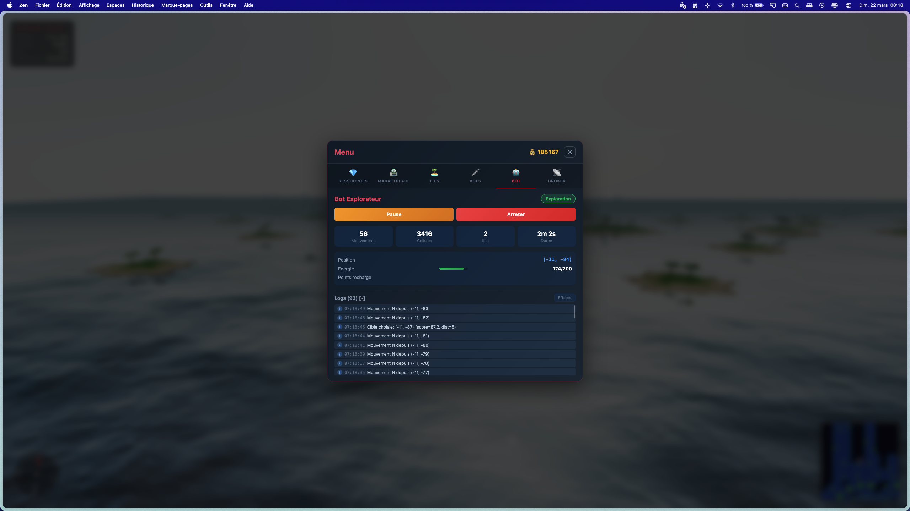
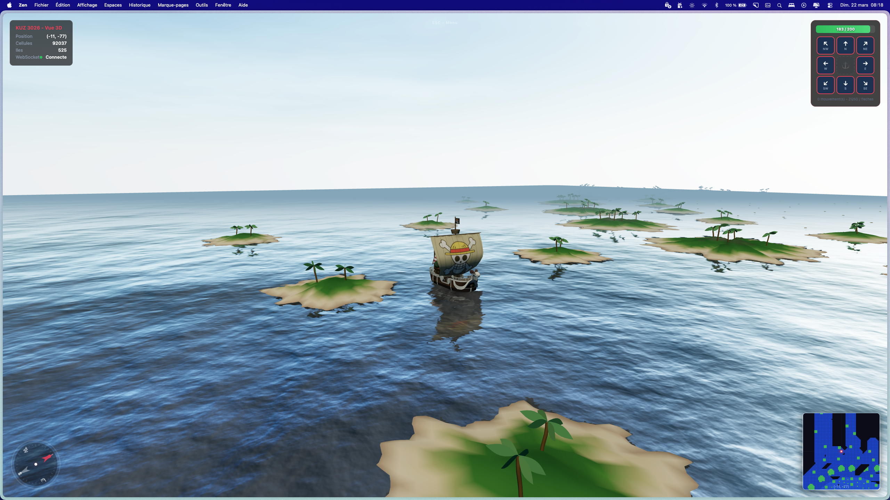
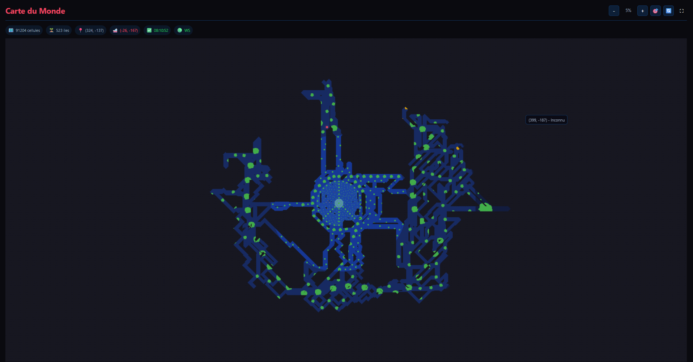
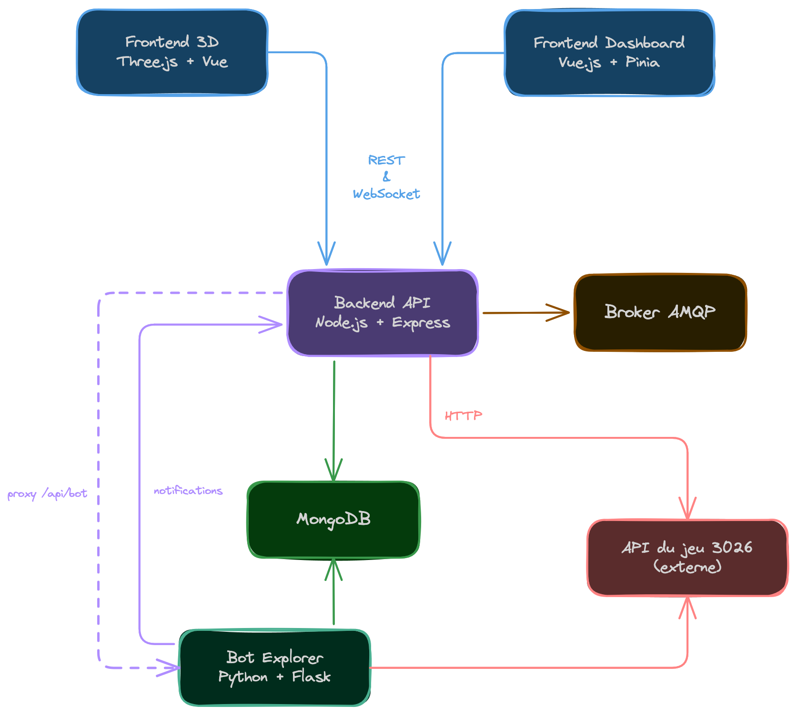

# KUZ - 24H DU CODE 2026 : Sujet "3026", porté par Covéa - Le Mans

Notre équipe est arrivée **2ème** du sujet proposé par Covéa Le Mans.

## Les développeurs

- **Ugo ROSERAT** : Frontend 3D avec Three.js (bateau, océan, îles procédurales, faune), WebSocket temps réel, CI/CD et déploiement Docker
- **Zakaria SALMI** : API backend, bot d'exploration, synchronisation des îles en BDD, contrôles clavier et carte 2D
- **Kévin ALVES** : API backend, dashboard frontend, marketplace avec historique des prix et broker AMQP

## Les stats fun

- **14 000+** lignes de code
- **258** commits
- **153** pull requests
- **0** heure de sommeil
- **24** heures de code

## Description

### Contexte

En l'an 3026, 404 ans après la frappe de l'astéroïde "status-302", la Terre s'est fragmentée en des milliers d'îles. Chaque équipe prend la tête d'une civilisation insulaire et doit explorer ce nouveau monde, découvrir des îles, collecter des ressources (Boisium, Feronium, Charbonium, Or), commercer via une marketplace et améliorer son bateau pour cartographier la carte le plus efficacement possible.

Le sujet a été proposé par la **MMA Covéa Le Mans** lors des 24H DU CODE 2026.

## Images

### IHM



### Interface 3D



### Map



### Objectifs

- Cartographier le monde en explorant les centaines d'îles de la carte
- Construire et améliorer un bateau (du radeau au niveau 5) pour augmenter portée de visibilité et points de mouvement
- Découvrir des îles pour augmenter la production de sa ressource principale
- Commercer avec les autres civilisations via la MarketPlace (achat/vente de ressources)
- Visualiser la carte du monde et les informations du jeu en temps réel
- Automatiser l'exploration grâce à un bot intelligent

### Technologies utilisées

| Composant | Technologies |
|-----------|-------------|
| Frontend 3D | Vue.js 3, Three.js, WebSocket |
| Frontend Dashboard | Vue.js 3, Pinia, Chart.js |
| Backend API | Node.js, Express, Mongoose, WebSocket |
| Bot d'exploration | Python 3, Flask, PyMongo |
| Base de données | MongoDB |
| Messaging | AMQP (RabbitMQ) |
| Infrastructure | Docker, Docker Compose, Nginx |

## Architecture du Projet

| Dossier | Description | Documentation |
|---|---|---|
| [`frontend-3d/`](frontend-3d/) | Vue 3D immersive (Three.js) — bateau, océan, îles procédurales, faune | [README](frontend-3d/README.md) |
| [`frontend/`](frontend/) | Dashboard Vue.js — carte 2D, marketplace, contrôle du bot | [README](frontend/README.md) |
| [`backend/`](backend/) | API Node.js/Express — proxy API du jeu, WebSocket, sync MongoDB | [README](backend/README.md) |
| [`bot-python/`](bot-python/) | Bot d'exploration autonome — algorithme de pathfinding intelligent | [README](bot-python/README.md) |
| [`archives/`](archives/) | Sujet du jeu, spécification API (OAS), backups du serveur et de la BDD | [README](archives/README.md) |

### Communication entre services

- **Frontend 3D** et **Frontend Dashboard** communiquent avec le **Backend** (WebSocket / REST)
- Le **Backend** se connecte à **MongoDB**, au **Broker AMQP** et à l'**API externe du jeu 3026**
- Le **Bot Python** appelle l'**API du jeu** directement (déplacements, position, taxes) et notifie le **Backend** (positions, cellules découvertes)
- Le **Bot Python** persiste ses données dans **MongoDB** (cellules explorées, îles, mouvements)
- Le **Backend** proxy les endpoints du bot (`/api/bot`) pour le contrôle depuis le dashboard



## Déploiement

### CI/CD — GitHub Actions

Chaque push sur `main` déclenche automatiquement le pipeline de déploiement :

```
Push sur main
    │
    ▼
┌─────────────────────────────────┐
│  Build (parallèle x4)          │
│  - frontend     → ghcr.io/…    │
│  - frontend-3d  → ghcr.io/…    │
│  - backend      → ghcr.io/…    │
│  - bot-python   → ghcr.io/…    │
└────────────┬────────────────────┘
             │
             ▼
┌─────────────────────────────────┐
│  Deploy                         │
│  Trigger webhook Portainer      │
│  → Pull des nouvelles images    │
│  → Redémarrage des containers   │
└─────────────────────────────────┘
```

Les 4 images Docker sont buildées en parallèle (matrice GitHub Actions), taguées `latest` + SHA du commit, et pushées sur **GitHub Container Registry** (`ghcr.io`).

Le déploiement est automatique via un **webhook Portainer** qui pull les nouvelles images et redémarre les containers.

### Docker Compose

Deux fichiers Docker Compose selon l'environnement :

| Fichier | Usage | Images |
|---|---|---|
| `docker-compose.local.yml` | Développement local | Build depuis les sources (`build: ./backend`) |
| `docker-compose.yml` | Production | Images pré-buildées depuis GHCR (`image: ghcr.io/…`) |

### Les services

| Service | Port local | Port prod | Description |
|---|---|---|---|
| `mongodb` | 27017 | aucun | Base de données MongoDB 7 |
| `backend` | 3001 | aucun | API Node.js + WebSocket |
| `frontend` | 3000 | aucun | Dashboard Vue.js |
| `frontend-3d` | 3002 | aucun | Vue 3D Three.js |
| `bot-python` | 3003 | aucun | Bot d'exploration Flask |
| `mongo-express` | 8081 | aucun | Interface admin MongoDB |

### Réseau en production — Cloudflare Tunnel

En production, **aucun port n'est exposé** sur le serveur. Tous les services sont accessibles uniquement via un **Cloudflare Tunnel** (`cloudflared`) qui fait office de reverse proxy sécurisé.

```
Internet (HTTPS)
    │
    ▼
Cloudflare (CDN + DNS)
    │
    │ tunnel chiffré (pas de port ouvert)
    ▼
cloudflared (sur le serveur)
    │
    ├── frontend-2d.domaine.fr       → frontend:80
    ├── frontend-3d.domaine.fr       → frontend-3d:80
    └── mongo-express.domaine.fr     → mongo-express:80
```

**Avantages :**
- **Zero port ouvert** : le serveur n'expose rien sur Internet, pas besoin de firewall
- **HTTPS automatique** : Cloudflare gère les certificats SSL, pas de config nginx TLS
- **Protection DDoS** : le trafic passe par Cloudflare avant d'atteindre le serveur
- **WebSocket supporté** : les connexions `/ws` et `/broker` passent nativement par le tunnel

Le `docker-compose.yml` de production ne contient aucune directive `ports:` — les services communiquent entre eux via le réseau Docker interne (`kuz-network`), et seul `cloudflared` y accède via le réseau `proxy_net`.

### Lancer en local

```bash
# Démarrer tous les services avec hot-reload (développement)
docker compose -f docker-compose.local.yml up --watch

# Démarrer en production (images GHCR)
docker compose up -d

# Rebuilder après un changement de dépendances
docker compose -f docker-compose.local.yml up --build
```

### Hot-reload (Docker Compose Watch)

En développement, `docker compose --watch` synchronise automatiquement les fichiers sources :

| Service | Action `sync` | Action `rebuild` |
|---|---|---|
| backend | `src/` → `/app/src` | `package.json` modifié |
| frontend | `src/` → `/app/src` | `package.json` modifié |
| frontend-3d | `src/` → `/app/src` | `package.json` modifié |
| bot-python | `*.py` → `/app` | `requirements.txt` modifié |

`sync` copie les fichiers modifiés dans le container sans le redémarrer.
`rebuild` reconstruit l'image Docker complète (nécessaire quand les dépendances changent).

### Autres workflows GitHub Actions

| Workflow | Déclencheur | Description |
|---|---|---|
| `deploy.yml` | Push sur `main` | Build + deploy automatique |
| `gitleaks.yml` | Push / PR | Détection de secrets dans le code |
| `auto-label.yml` | PR | Labellisation automatique des PR |
