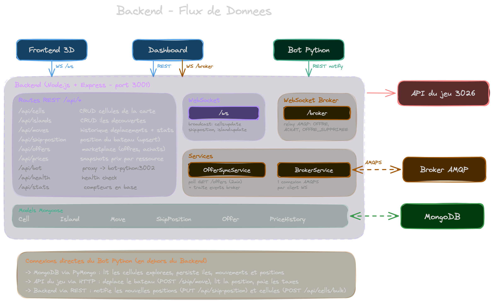
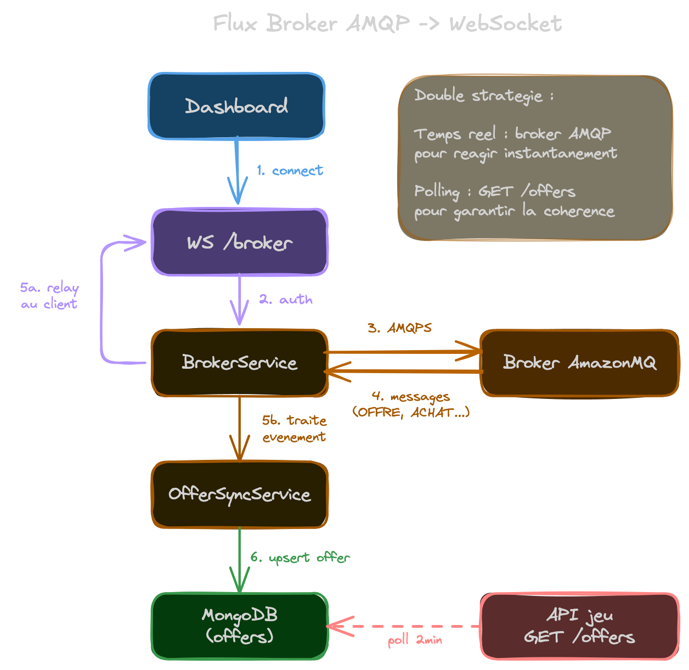

# Backend API — KUZ 3026

Le backend est le coeur du projet. C'est un serveur **Node.js / Express** qui fait le lien entre les frontends, la base de données MongoDB, le broker AMQP du jeu et l'API externe 3026.

## Stack technique

| Technologie | Role |
|---|---|
| **Node.js 20** | Runtime JavaScript |
| **Express** | Framework HTTP / REST API |
| **Mongoose** | ODM pour MongoDB (schemas, validation, index) |
| **ws** | Serveur WebSocket natif |
| **amqplib** | Client AMQP pour se connecter au broker du jeu |

## Structure du projet

```
backend/
├── Dockerfile              # Image Docker (node:20-alpine)
├── package.json            # Dependencies et scripts
└── src/
    ├── index.js            # Point d'entree : Express, MongoDB, WebSocket, routes
    ├── ws.js               # Gestion WebSocket broadcast (/ws)
    ├── models/             # Schemas Mongoose (MongoDB)
    │   ├── Cell.js         # Cellules de la carte (SEA, SAND)
    │   ├── Island.js       # Iles decouvertes
    │   ├── Move.js         # Historique des deplacements
    │   ├── ShipPosition.js # Position actuelle du bateau
    │   ├── Offer.js        # Offres du marketplace
    │   └── PriceHistory.js # Historique des prix des ressources
    ├── routes/             # Endpoints REST
    │   ├── cells.js        # CRUD cellules de la carte
    │   ├── islands.js      # CRUD iles
    │   ├── moves.js        # Historique + stats des mouvements
    │   ├── shipPosition.js # Position du bateau (GET/PUT)
    │   ├── offers.js       # Marketplace (offres, achats, sync)
    │   ├── priceHistory.js # Historique des prix
    │   └── bot.js          # Proxy vers le bot Python
    └── services/           # Logique metier asynchrone
        ├── brokerService.js    # Connexion AMQP + relay WebSocket
        └── offerSyncService.js # Sync periodique des offres marketplace
```

## Comment ca marche

### Le flux de donnees



Le backend a **3 roles principaux** :

1. **Persister les donnees du jeu** — Quand le bot explore la carte, il envoie les cellules decouvertes, les iles, les positions du bateau. Le backend les stocke dans MongoDB pour que les frontends puissent les afficher.

2. **Relayer les evenements temps reel** — Le broker AMQP du jeu envoie des evenements (nouvelle offre, achat, offre supprimee). Le backend se connecte au broker et retransmet ces evenements aux frontends via WebSocket.

3. **Synchroniser le marketplace** — Toutes les 2 minutes, le backend interroge l'API du jeu pour recuperer les offres en cours et les persiste en base. En complement, les evenements broker permettent des mises a jour en temps reel.

## API REST — Endpoints

### Cellules (`/api/cells`)

Les cellules sont les cases de la carte du jeu. Chaque case a un type (`SEA` ou `SAND`) et peut appartenir a une ile.

| Methode | Route | Description |
|---|---|---|
| `GET` | `/api/cells?gameId=` | Recuperer toutes les cellules d'une partie |
| `GET` | `/api/cells/bounds?gameId=` | Obtenir les limites min/max de la carte |
| `POST` | `/api/cells/bulk` | Inserer/mettre a jour des cellules en masse |
| `PATCH` | `/api/cells/state` | Changer l'etat d'un lot de cellules |
| `DELETE` | `/api/cells?gameId=` | Supprimer toutes les cellules d'une partie |

> Le `POST /api/cells/bulk` est l'endpoint le plus appele : le bot l'utilise apres chaque deplacement pour envoyer les nouvelles cellules decouvertes. Il declenche un broadcast WebSocket `cells:update` pour que les frontends se mettent a jour en direct.

### Iles (`/api/islands`)

Une ile est un ensemble de cellules `SAND` avec un nom et un bonus de productivite.

| Methode | Route | Description |
|---|---|---|
| `GET` | `/api/islands?gameId=` | Lister toutes les iles |
| `POST` | `/api/islands` | Creer ou mettre a jour une ile |
| `POST` | `/api/islands/add-cell` | Ajouter une cellule a une ile |
| `PATCH` | `/api/islands/:islandId/state` | Changer l'etat (DISCOVERED → KNOWN) |
| `DELETE` | `/api/islands?gameId=` | Supprimer toutes les iles |

> Une ile passe de `DISCOVERED` (vue depuis la mer) a `KNOWN` (validee en accostant sur une ile connue). Seules les iles `KNOWN` augmentent la production de ressources.

### Position du bateau (`/api/ship-position`)

Un seul document par partie, mis a jour a chaque deplacement.

| Methode | Route | Description |
|---|---|---|
| `GET` | `/api/ship-position/:gameId` | Position actuelle |
| `PUT` | `/api/ship-position/:gameId` | Mettre a jour la position |

> Le `PUT` declenche un broadcast WebSocket `ship:position` pour que le frontend 3D deplace le bateau en temps reel.

### Mouvements (`/api/moves`)

Chaque deplacement du bateau est enregistre avec sa direction, l'energie consommee et le nombre de cellules decouvertes.

| Methode | Route | Description |
|---|---|---|
| `GET` | `/api/moves/:gameId` | Les 500 derniers mouvements |
| `GET` | `/api/moves/:gameId/recent/:limit` | Les N derniers mouvements |
| `POST` | `/api/moves` | Enregistrer un nouveau mouvement |
| `GET` | `/api/moves/:gameId/stats` | Stats agregees (total, directions, cellules) |
| `DELETE` | `/api/moves/:gameId` | Supprimer l'historique |

### Marketplace — Offres (`/api/offers`)

La marketplace permet aux joueurs d'echanger des ressources. Chaque joueur ne produit qu'une seule des 3 ressources primaires (Boisium, Feronium, Charbonium), donc le commerce est indispensable.

| Methode | Route | Description |
|---|---|---|
| `GET` | `/api/offers/:gameId` | Toutes les offres actives |
| `GET` | `/api/offers/:gameId/:resourceType` | Offres filtrees par ressource |
| `POST` | `/api/offers/:gameId/sync` | Sync complete depuis l'API du jeu |
| `POST` | `/api/offers/:gameId/broker/offer` | Nouvelle offre (via evenement broker) |
| `POST` | `/api/offers/:gameId/broker/purchase` | Achat d'une offre (via broker) |
| `POST` | `/api/offers/:gameId/broker/delete` | Suppression d'offre (via broker) |
| `POST` | `/api/offers/:gameId/own` | Creer/modifier sa propre offre |
| `GET` | `/api/offers/:gameId/status` | Etat de la derniere sync |

### Historique des prix (`/api/prices`)

Des snapshots periodiques des prix moyens par ressource, utilises pour afficher des graphiques d'evolution dans le dashboard.

| Methode | Route | Description |
|---|---|---|
| `GET` | `/api/prices/:gameId?hours=24` | Historique pour toutes les ressources |
| `GET` | `/api/prices/:gameId/:resourceType` | Historique pour une ressource |
| `POST` | `/api/prices` | Enregistrer un snapshot de prix |
| `POST` | `/api/prices/bulk` | Enregistrer plusieurs snapshots |
| `GET` | `/api/prices/:gameId/latest/all` | Dernier prix connu par ressource |
| `DELETE` | `/api/prices/:gameId` | Supprimer l'historique |

### Bot (`/api/bot`)

Simple proxy qui redirige toutes les requetes vers le service Python `bot-python:3002`. Ca permet au dashboard de controler le bot sans connaitre son adresse interne.

| Methode | Route | Description |
|---|---|---|
| `POST` | `/api/bot/start` | Demarrer le bot |
| `POST` | `/api/bot/stop` | Arreter le bot |
| `POST` | `/api/bot/pause` | Mettre en pause |
| `POST` | `/api/bot/resume` | Reprendre |
| `GET` | `/api/bot/status` | Etat actuel du bot |
| `GET` | `/api/bot/logs?since=` | Recuperer les logs |
| `DELETE` | `/api/bot/logs` | Effacer les logs |

### Utilitaires

| Methode | Route | Description |
|---|---|---|
| `GET` | `/api/health` | Health check |
| `GET` | `/api/stats` | Nombre de cellules et iles en base |

## WebSocket

Le backend expose **2 endpoints WebSocket** sur le meme port (3001) :

### `/ws` — Broadcast des evenements du jeu

Connexion simple, pas d'authentification. Le serveur broadcast des messages JSON a tous les clients connectes quand les donnees changent :

```json
{ "event": "cells:update", "data": { "count": 42, "gameId": "..." } }
{ "event": "ship:position", "data": { "x": 10, "y": 20, "type": "SEA" } }
{ "event": "island:update", "data": { "islandId": "...", "name": "..." } }
```

**Utilise par** : Frontend 3D (position du bateau, nouvelles cellules), Frontend Dashboard (carte 2D)

### `/broker` — Relay du broker AMQP



Protocole plus complexe avec authentification :

```
1. Client se connecte a ws://backend:3001/broker
2. Client envoie : { "type": "connect", "username": "KUZ", "password": "<id>", "playerId": "<id>" }
3. Backend ouvre une connexion AMQPS vers le broker AWS AmazonMQ
4. Backend consomme la queue "user.<playerId>"
5. Chaque message broker est retransmis au client WebSocket
6. En parallele, les evenements marketplace sont traites par offerSyncService
```

**Evenements retransmis** : `OFFRE` (nouvelle offre), `ACHAT` (quelqu'un a achete), `OFFRE_SUPPRIMEE` (offre retiree)

**Utilise par** : Frontend Dashboard (marketplace temps reel)

## Models MongoDB

### Cell
```
{gameId, x, y, type, zone, island, state, discoveredAt, lastSeenAt}
```
Index unique sur `{gameId, x, y}` — une seule entree par case de la carte.

### Island
```
{gameId, islandId, name, bonusQuotient, state, cells[], discoveredAt}
```
Index unique sur `{gameId, islandId}`.

### Move
```
{gameId, direction, fromPosition, toPosition, energyBefore, energyAfter, cellsDiscovered, timestamp}
```

### ShipPosition
```
{gameId, x, y, type, zone}
```
Un seul document par partie (upsert).

### Offer
```
{offerId, gameId, owner, resourceType, quantity, unitPrice, createdAt, deleted, isOwn}
```
Index compose sur `{gameId, resourceType, deleted}` pour les requetes filtrees.

### PriceHistory
```
{gameId, resourceType, avgPrice, minPrice, maxPrice, offerCount, totalQuantity, timestamp}
```

## Services

### BrokerService

Le `BrokerService` gere les connexions AMQP **par client WebSocket**. Chaque utilisateur du dashboard qui se connecte au broker obtient sa propre connexion AMQPS vers le broker AWS.

**Cycle de vie :**
1. Le client WebSocket se connecte a `/broker`
2. Il envoie un message `connect` avec ses identifiants
3. Le service ouvre une connexion AMQPS vers AmazonMQ
4. Il cree un channel et consomme la queue `user.<playerId>`
5. Chaque message recu est retransmis au client + traite par `OfferSyncService`
6. A la deconnexion, le channel et la connexion sont fermes proprement

### OfferSyncService

Le `OfferSyncService` maintient la collection `offers` a jour avec deux strategies :

**1. Polling (toutes les 2 minutes)**
- Appelle `GET /marketplace/offers` sur l'API du jeu
- Upsert toutes les offres recues
- Marque comme `deleted` les offres absentes de la reponse
- Gere le rate-limiting (`TOO_FAST_TOO_FURIOUS`)

**2. Temps reel (via le broker)**
- `OFFRE` → Cree ou met a jour l'offre en base
- `ACHAT` → Decremente la quantite, supprime si quantite = 0
- `OFFRE_SUPPRIMEE` → Soft-delete de l'offre

> Les deux strategies sont complementaires : le polling assure la coherence globale, le broker assure la reactivite.

## Variables d'environnement

| Variable | Default | Description |
|---|---|---|
| `PORT` | `3001` | Port du serveur HTTP/WebSocket |
| `MONGODB_URI` | `mongodb://localhost:27017/kuz3026` | URI de connexion MongoDB |
| `EXTERNAL_API_URL` | `http://ec2-...amazonaws.com:8443` | URL de l'API du jeu 3026 |
| `CODINGGAME_ID` | *(token JWT)* | Token d'authentification pour l'API du jeu |
| `GAME_ID` | `kuz-default` | Identifiant de la partie en cours |
| `BOT_PYTHON_URL` | `http://bot-python:3002` | URL interne du bot Python |

## Lancer en local

```bash
# Avec Docker Compose (recommande)
docker compose -f docker-compose.local.yml up backend mongodb

# Sans Docker
cd backend
npm install
export MONGODB_URI=mongodb://localhost:27017/kuz3026
npm start        # production
npm run dev      # avec hot-reload (--watch)
```
