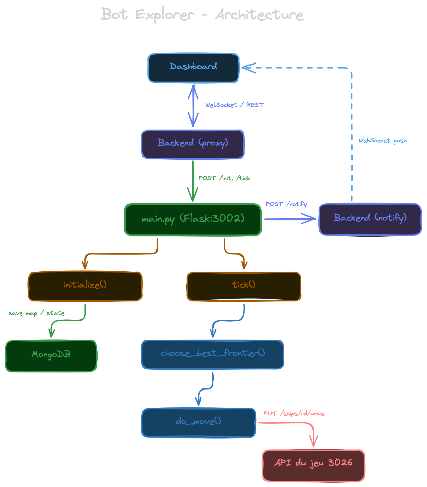
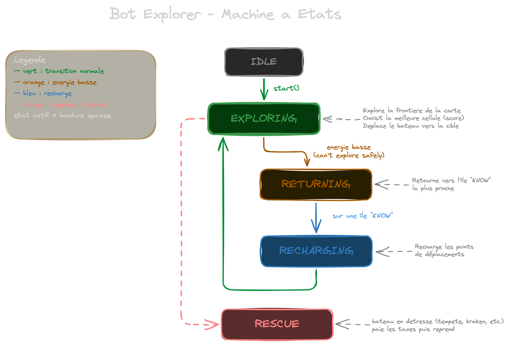

# Bot Explorer — KUZ 3026

Bot d'exploration autonome qui cartographie la carte du jeu 3026. Il deplace le bateau intelligemment pour decouvrir un maximum de cellules et d'iles, gere son energie, et revient se recharger sur les iles connues quand necessaire.

## Stack technique

| Technologie | Role |
|---|---|
| **Python 3** | Langage principal |
| **Flask** | API REST pour le controle du bot (start/stop/pause/resume) |
| **PyMongo** | Acces direct a MongoDB (cellules, iles, positions) |
| **Requests** | Client HTTP vers l'API du jeu et notre backend |

## Structure du projet

```
bot-python/
├── Dockerfile           # Image Python Alpine
├── requirements.txt     # Dependencies : flask, pymongo, requests, etc.
├── config.py            # Configuration (URLs, tokens, parametres du bot)
├── main.py              # Serveur Flask — API de controle du bot
├── api_client.py        # Clients HTTP (API du jeu + notre backend)
├── database.py          # Acces MongoDB (cellules, iles, positions, mouvements)
└── explorer.py          # SmartExplorer — le cerveau du bot (algorithme d'exploration)
```

## Comment ca marche

### Architecture

Le bot tourne dans un **thread daemon** separe du serveur Flask. Le dashboard controle le bot via l'API Flask (start/stop/pause), et le bot explore la carte en autonome.



### La machine a etats

Le bot fonctionne comme une **machine a etats** avec 5 etats :



### L'algorithme d'exploration

Le bot utilise un systeme de **frontiere** inspire des algorithmes de flood fill :

1. **Cellules explorees** : toutes les cellules deja vues (stockees dans un `set`)
2. **Frontiere** : les cellules explorees qui ont au moins un voisin inexplore
3. **Choix de cible** : le bot evalue chaque cellule de la frontiere avec un score :
   - `+100 / (distance + 1)` : prefere les cellules proches
   - `+15 * voisins_inconnus` : prefere les cellules avec beaucoup de terrain inexplore autour
   - `-0.5 * distance_retour_base` : penalise les cellules loin d'une base de recharge
   - Filtre les cellules inaccessibles (cout aller + retour > energie disponible)

### La gestion de l'energie

Le bateau a une capacite limitee de points de mouvement. Le bot gere ca avec :

- **SAFETY_BUFFER** (5 points) : marge de securite pour toujours pouvoir rentrer
- **Distance de Chebyshev** : distance en 8 directions (max de |dx|, |dy|), car le bateau peut se deplacer en diagonale
- **Seuil de recharge** (80%) : le bot reprend l'exploration quand l'energie atteint 80% du max

### Les bases de recharge

Dans le jeu, l'energie se regenere quand le bateau est sur une ile **KNOWN** (validee). Le bot :

1. Charge les iles KNOWN depuis l'API du joueur
2. Recupere les cellules SAND de ces iles depuis MongoDB
3. Chaque cellule SAND d'une ile KNOWN est une "base de recharge"
4. Quand l'energie est basse, il retourne vers la base la plus proche

### La gestion des erreurs

Le jeu a plusieurs sources de problemes :
- **Detresse** (tempete, kraken, pirate) → le bot passe en mode RESCUE, paie les taxes
- **Rate limiting** (TOO_FAST_TOO_FURIOUS) → attend le prochain tick
- **Erreur d'auth** (401/403) → arrete le bot
- **Remorquage** → detecte quand l'energie remonte brutalement apres une panne, repositionne le bateau

### La double persistance

Chaque mouvement est persiste de **deux manieres** :

1. **MongoDB (direct via PyMongo)** : cellules, iles, mouvements, position — pour la reconstruction de la carte
2. **Backend (HTTP notification)** : position et cellules — pour le temps reel (WebSocket → frontends)

Les notifications vers le backend sont fire-and-forget (`except: pass`) : si le backend est down, le bot continue sans interruption.

## API de controle (Flask, port 3002)

| Methode | Route | Description |
|---|---|---|
| `GET` | `/health` | Health check |
| `POST` | `/bot/start` | Demarrer le bot |
| `POST` | `/bot/stop` | Arreter le bot |
| `POST` | `/bot/pause` | Mettre en pause |
| `POST` | `/bot/resume` | Reprendre |
| `GET` | `/bot/status` | Etat complet (position, energie, stats, etc.) |
| `GET` | `/bot/logs?since=` | Logs depuis un ID donne |
| `DELETE` | `/bot/logs` | Effacer les logs |

## Configuration (`config.py`)

| Variable | Default | Description |
|---|---|---|
| `GAME_API` | `http://ec2-...8443` | URL de l'API du jeu |
| `CODINGGAME_ID` | *(token JWT)* | Token d'authentification |
| `MONGO_URI` | `mongodb://mongodb:27017/kuz` | URI MongoDB |
| `GAME_ID` | `kuz-default` | Identifiant de la partie |
| `BACKEND_API` | `http://backend:3001` | URL de notre backend |
| `SAFETY_BUFFER` | `5` | Points d'energie de reserve |
| `TICK_INTERVAL` | `1.0` | Delai entre chaque mouvement (secondes) |
| `RECHARGE_THRESHOLD` | `0.8` | Seuil de recharge (80% du max) |

## Lancer en local

```bash
# Avec Docker Compose (recommande)
docker compose -f docker-compose.local.yml up bot-python backend mongodb

# Sans Docker
cd bot-python
pip install -r requirements.txt
export MONGO_URI=mongodb://localhost:27017/kuz
python main.py    # http://localhost:3002
```
