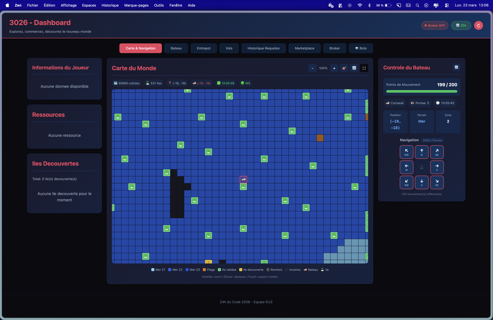

# Frontend Dashboard — KUZ 3026

Le dashboard est l'interface principale pour piloter notre civilisation dans le jeu 3026. C'est une **single-page application** Vue.js qui affiche en temps reel l'etat du jeu : carte 2D, ressources, marketplace, controle du bateau et du bot d'exploration.

## Stack technique

| Technologie | Role |
|---|---|
| **Vue.js 3** | Framework UI reactif (Composition API + Options API) |
| **Pinia** | State management (stores reactifs) |
| **Vue Router** | Navigation (une seule page : Dashboard) |
| **Axios** | Client HTTP pour les appels API |
| **Chart.js + vue-chartjs** | Graphiques d'evolution des prix marketplace |
| **Vite** | Build tool + dev server avec hot-reload |
| **Nginx** | Serveur de production (reverse proxy vers backend) |

## Structure du projet

```
frontend/
├── Dockerfile              # Multi-stage : build Vite + serve Nginx
├── nginx.conf              # Proxy /api, /ws, /broker, /backend-api vers backend
├── index.html              # Shell HTML de la SPA
├── package.json
├── vite.config.js          # Proxy dev : API jeu + backend + WebSocket
└── src/
    ├── main.js             # Point d'entree : cree l'app Vue + Pinia + Router
    ├── App.vue             # Composant racine (router-view + styles globaux)
    ├── style.css           # Variables CSS du theme (dark mode)
    ├── router/
    │   └── index.js        # Une seule route : / → Dashboard
    ├── api/                # Couche HTTP
    │   ├── config.js       # Credentials du jeu (token JWT, IDs)
    │   ├── client.js       # Axios vers l'API du jeu (/api)
    │   └── mapApi.js       # Axios vers notre backend (/backend-api)
    ├── stores/             # Etat global reactif (Pinia)
    │   ├── player.js       # Infos joueur, ressources, iles decouvertes
    │   ├── ship.js         # Position, energie, cooldown, historique mouvements
    │   ├── map.js          # Cellules de la carte, iles, WebSocket /ws
    │   ├── broker.js       # Connexion WebSocket /broker (AMQP relay)
    │   ├── marketplace.js  # Offres, prix, events broker marketplace
    │   ├── bot.js          # Controle du bot d'exploration Python
    │   └── history.js      # Historique des requetes HTTP (debug)
    ├── views/
    │   └── Dashboard.vue   # La page principale (layout 3 colonnes + onglets)
    └── components/
        ├── PlayerInfo.vue        # Infos joueur (nom, or, production, stockage)
        ├── ResourcesDisplay.vue  # Cartes des ressources (BOISIUM, FERONIUM, CHARBONIUM)
        ├── IslandsDisplay.vue    # Liste des iles decouvertes
        ├── ShipControl.vue       # Controle du bateau (pad directionnel + clavier)
        ├── WorldMap.vue          # Carte 2D interactive (canvas, zoom, drag)
        ├── Marketplace.vue       # Interface de trading 3 colonnes
        ├── BrokerPanel.vue       # Visualisation des events AMQP en temps reel
        ├── BotsPanel.vue         # Controle et monitoring du bot Python
        ├── ShipUpgradePanel.vue  # Amelioration du bateau (niveaux, couts)
        ├── StorageUpgradePanel.vue # Amelioration de l'entrepot
        ├── TheftsPanel.vue       # Interface de vol de ressources
        └── RequestHistory.vue    # Log des requetes HTTP (debug)
```

## Comment ca marche

### Double API

Le dashboard communique avec **deux serveurs** :

| Serveur | URL en dev | URL en prod (nginx) | Role |
|---|---|---|---|
| **API du jeu** | `/api` → EC2:8443 | `/api/` → EC2:8443 | Source de verite : joueur, bateau, marketplace, vols |
| **Notre backend** | `/backend-api` → localhost:3001 | `/backend-api/` → backend:3001 | Persistence : carte, iles, mouvements, prix, offres cache, bot |

Le fichier `vite.config.js` configure les proxies pour le dev, `nginx.conf` pour la production.

### Temps reel (WebSocket)

Le dashboard utilise **deux connexions WebSocket** :

**1. `/ws` — Evenements de la carte** (dans `stores/map.js`)
- `cells:update` → nouvelles cellules decouvertes par le bot
- `ship:position` → le bateau a bouge
- `island:update` → nouvelle ile decouverte

**2. `/broker` — Evenements marketplace** (dans `stores/broker.js`)
- `OFFRE` → nouvelle offre sur le marketplace
- `ACHAT` → quelqu'un a achete une offre
- `OFFRE_SUPPRIMEE` → offre retiree
- `DISCOVERED_ISLAND` → ile decouverte par un autre joueur
- `VOL` → tentative de vol

Le broker utilise un protocole d'authentification : le dashboard envoie ses credentials, le backend ouvre une connexion AMQPS vers Amazon MQ et relay les messages.

### Stores Pinia

Les stores sont le coeur de la logique. Chaque store gere un domaine :

| Store | Responsabilite | Source de donnees |
|---|---|---|
| `player` | Infos joueur, ressources, iles | API du jeu (polling 30s) |
| `ship` | Position, energie, cooldown, mouvements | API du jeu + localStorage + backend DB |
| `map` | Cellules, iles, vue de la carte | Backend DB + WebSocket /ws |
| `broker` | Connexion AMQP, messages temps reel | WebSocket /broker |
| `marketplace` | Offres, prix, achats/ventes | Broker events + backend cache + API du jeu |
| `bot` | Etat du bot, logs | Backend proxy (polling 2s) |
| `history` | Log des requetes HTTP | Intercepteur Axios |

### La carte 2D (`WorldMap.vue`)

La carte est rendue sur un `<canvas>` HTML5 :
- Chaque cellule fait 28px de base, zoomable de 5% a 300%
- Les couleurs varient par zone (5 nuances de bleu pour la mer)
- Drag avec inertie (momentum + friction), zoom a la molette
- Tooltip au survol avec infos de la cellule
- Le bateau est centre automatiquement quand il bouge

### Le controle du bateau (`ShipControl.vue`)

Le pad directionnel 3x3 supporte :
- Clic sur les boutons (N, NE, E, SE, S, SW, W, NW)
- Raccourcis clavier : fleches, ZQSD (layout FR), AZWX (diagonales), pave numerique
- Cooldown visuel entre chaque deplacement
- Affichage de l'energie restante avec barre coloree

### Le marketplace (`Marketplace.vue`)

Interface de trading en 3 colonnes :
- **Gauche** : vue d'ensemble des prix par ressource + nos offres
- **Centre** : graphique d'evolution des prix + carnet d'ordres
- **Droite** : achat rapide au meilleur prix

Les donnees viennent en priorite du broker (temps reel), avec fallback sur le cache backend, puis l'API du jeu en dernier recours.

## Theme visuel

Le dashboard utilise un theme sombre :

```css
--primary:    #e94560   /* rouge/rose — accent principal */
--secondary:  #0f3460   /* bleu fonce — fond des elements */
--background: #0a0a0f   /* quasi-noir — fond de page */
--surface:    #1a1a2e   /* bleu-gris — cartes et panneaux */
--text:       #ffffff
```

## Variables d'environnement

| Variable | Default | Description |
|---|---|---|
| `VITE_BACKEND_URL` | `http://localhost:3001` | URL du backend Node.js |
| `VITE_GAME_ID` | `kuz-default` | Identifiant de la partie |

## Lancer en local

```bash
# Avec Docker Compose (recommande)
docker compose -f docker-compose.local.yml up frontend backend mongodb

# Sans Docker (dev avec hot-reload)
cd frontend
npm install
cp .env.example .env    # configurer les variables
npm run dev             # http://localhost:5173
```

## Layout du Dashboard


